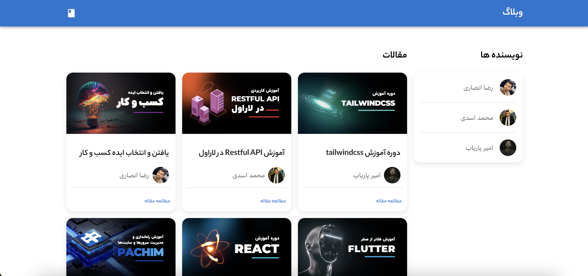
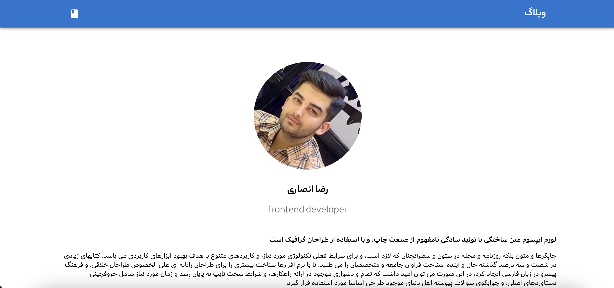

# ShopStore

This project is a blog website built using `React` and `GraphQL`. It utilizes various technologies and libraries to create a seamless and interactive user experience.


## Features

- **Hygraph (GraphCMS):** Used for creating and managing the API. `GraphCMS` provides a headless CMS for delivering digital experiences.
- **Material-UI (MUI) Framework:** A popular React `UI` framework for building responsive and attractive user interfaces.
- **Sanitize-HTML:** Used for preventing `XSS` attacks. This library ensures that user-generated content is sanitized and safe to render.

## Technologies Used

- **React:** A JavaScript library for building user interfaces. It enables the creation of reusable UI components.

- **GraphQL:** A query language for APIs that allows efficient and flexible communication between the client and server.

- **Hygraph (GraphCMS):** Used for creating and managing the API. GraphCMS provides a headless CMS for delivering digital experiences.

- **Apollo:** Used to connect React with GraphQL. Apollo Client simplifies data management in the UI and handles communication with the GraphQL server.

- **Material-UI (MUI) Framework:** A popular React UI framework for building responsive and attractive user interfaces.

- **React Router DOM:** Enables navigation and routing between different pages in the React application.

- **Sanitize-HTML:** Used for preventing XSS attacks. This library ensures that user-generated content is sanitized and safe to render.

- **React-Toastify:** Utilized for displaying informative messages to users in a non-intrusive way.

## Getting Started

1. Clone the repository:

   ```bash
   git clone https://github.com/rezaansarirad/blog-GraphQL.git
   ```

2. Install dependencies:

   ```bash
   npm install
   ```

3. Run the project:

   ```bash
   npm start
   ```

## Screenshots




<!-- Add more screenshots if needed -->

## Contributing

Feel free to contribute to the project by opening issues or creating pull requests. Your feedback and suggestions are highly appreciated.

Hope you enjoy.
